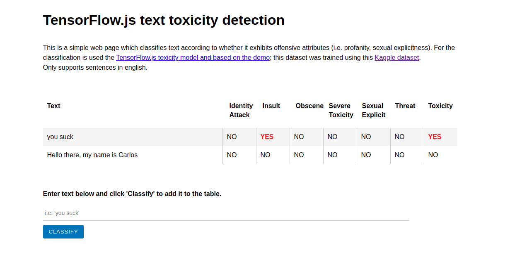

# TensorFlow.js text toxicity detection

This is a simple web page which classifies text according to whether it exhibits offensive attributes (i.e. profanity, sexual explicitness). For the classification is used the [TensorFlow.js toxicity model and based on the demo](https://www.npmjs.com/package/@tensorflow-models/toxicity); this dataset was trained using this [Kaggle dataset](https://www.kaggle.com/c/jigsaw-toxic-comment-classification-challenge/data)

